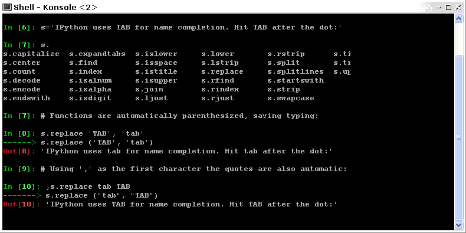
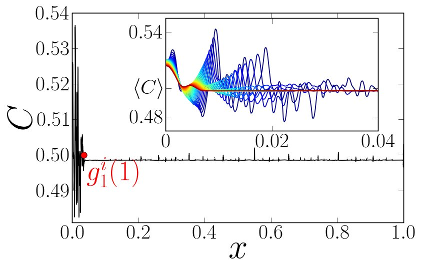
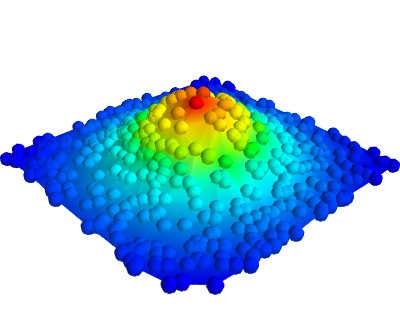

Basic Building Blocks
---------------------

Scientific Python is un-bundled, so users need some basic building blocks.

<aside class="notes">
Unlike Matlab, Scilab or R, Python does not come with a pre-bundled set
of modules for scientific computing. Below are the basic building blocks
that can be combined to obtain a scientific computing environment:
</aside>

-   **Python**, a generic and modern computing language

    -   Python language: data types (`string`, `int`), flow control,
        data collections (lists, dictionaries), patterns, etc.
    
	-   Modules of the standard library.
    
    -   A large number of specialized modules or applications written
        in Python: web protocols, web framework, etc. ... and
        scientific computing.
    
    -   Development tools (automatic testing, documentation
        generation)

      
-   **IPython**, an advanced **Python shell**
    [http://ipython.org](http://ipython.org)/

-   **Numpy** : provides powerful **numerical arrays** objects, and
    routines to manipulate them.
    [http://www.numpy.org](http://www.numpy.org)/

-   **Scipy** : high-level data processing routines. Optimization,
    regression, interpolation, etc
    [http://www.scipy.org](http://www.scipy.org)/

      
-   **Matplotlib** : 2-D visualization, "publication-ready" plots
    [http://matplotlib.org/](http://matplotlib.org/)

-   **SymPy**:  Symbolic computing inside python
    [http://sympy.org](http://sympy.org)

-   **Pandas**: Data manipulation
    [http://pandas.pydata.org](http://pandas.pydata.org)

-   **PyTables**: Very large on node files and operations
    [http://www.pytables.org/](http://www.pytables.org/)

-   **Cython**: Compile Typed Python to C and call C functions
    [http://cython.org/](http://cython.org/)

      
-   **Mayavi** : 3-D visualization
    [http://code.enthought.com/projects/mayavi](http://code.enthought.com/projects/mayavi)/
