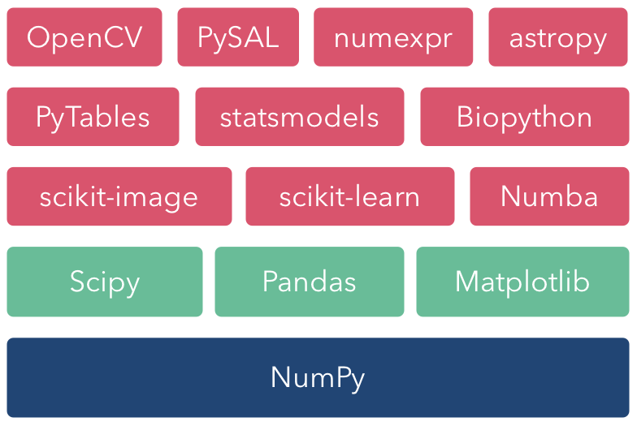

NumPy
-----

Python library that provides multi-dimensional arrays, tables, and matrices for Python

<center>

</center>

- Contiguous or strided arrays
- Homogeneous (but types can be algebraic)
 - Arrays of records and nested records
- Fast routines for array operations (C, ATLAS, MKL)


## NumPy's Many Uses

- Image and signal processing
- Linear algebra
- Data transformation and query
- Time series analysis
- Statistical analysis
- Many more!
  
<br/><br/>
## NumPy is the foundation of the Python scientific stack


### NumPy Ecosystem

<center>

</center>


### Basic array tour

```python
In [18]: a = np.array([0,1,2,3,4,5], dtype=int)

In [19]: a
Out[19]: array([0, 1, 2, 3, 4, 5])

In [20]: a[1:3]
Out[20]: array([1, 2])

In [21]: a.ndim
Out[21]: 1

In [22]: a.shape
Out[22]: (6,)
```


### Simple 2D
```python
In [24]: b = np.array([[0,1,2],[3,4,5],[6,7,8]], dtype=float)

In [25]: b.ndim
Out[25]: 2

In [26]: b.shape
Out[26]: (3, 3)

In [27]: b[1:3,1:3]
Out[27]: 
array([[4., 5.],
       [7., 8.]])
       
In [31]: b[..., 1:3]
Out[31]: 
array([[1., 2.],
       [4., 5.],
       [7., 8.]])
```


But I thought arrays were just a pointer?  
```python
In [47]: c = np.arange(9)

In [48]: c.data
Out[48]: <read-write buffer for 0x7f923b47d3f0, size 72, offset 0 at 0x107782930>

In [49]: c.strides
Out[49]: (8,)

In [50]: c.shape
Out[50]: (9,)

In [51]: d = c.reshape((3,3))

In [52]: d.data
Out[52]: <read-write buffer for 0x7f923b51b470, size 72, offset 0 at 0x1077829b0>

In [53]: d.strides
Out[53]: (24, 8)

In [54]: d.shape
Out[54]: (3, 3)
```


### Common arrays

```python
In [66]: print np.arange(10) # Like range [0, 1, ..., 9]
[0 1 2 3 4 5 6 7 8 9]

In [67]: print np.arange(1,9, 2) # [1, 3, 5, 7]
[1 3 5 7]

In [68]: print np.linspace(0, 1, 6) # A linear space of [0,1] with 6 pts
[ 0.   0.2  0.4  0.6  0.8  1. ]

In [69]: print np.linspace(0, 1, 6, endpoint=False) # [0,1[
[ 0.          0.16666667  0.33333333  0.5         0.66666667  0.83333333]
```


### Common arrays
```python
In [70]: print np.ones((3,3)) # 3 X 3 2D array of 1's
[[ 1.  1.  1.]
 [ 1.  1.  1.]
 [ 1.  1.  1.]]

In [71]: print np.eye(3)
[[ 1.  0.  0.]
 [ 0.  1.  0.]
 [ 0.  0.  1.]]

In [72]: print np.diag(np.arange(4))
[[0 0 0 0]
 [0 1 0 0]
 [0 0 2 0]
 [0 0 0 3]]

In [73]: print np.random.rand(4) # Uniform distribution
[ 0.39259348  0.84921539  0.70292474  0.10054081]

In [74]: print np.random.randn(4) # Gaussian distribution
[ 0.53405047 -3.12422252  0.19564584  0.217296  ]
```


### Fast operations

Just like matlab, vectorized operations are much faster in NumPy
```python
In [9]: %timeit [x + 1 for x in xrange(100000)]
100 loops, best of 3: 8.38 ms per loop

In [10]: %timeit np.arange(100000) + 1
10000 loops, best of 3: 153 us per loop

In [11]: a = range(100)
In [12]: b = range(100)
In [13]: %timeit [a[i]*b[i] for i in xrange(len(a))]
100000 loops, best of 3: 19.8 us per loop

In [15]: c = np.arange(100)
In [16]: d = np.arange(100)
In [17]: %timeit c*d
100000 loops, best of 3: 2.25 us per loop
```


### Scalar and aggregate operations

```python
In [90]: b = np.arange(10)

In [91]: b * 2 + 1
Out[91]: array([ 1,  3,  5,  7,  9, 11, 13, 15, 17, 19])

In [93]: np.max(b)
Out[93]: 9

In [94]: np.sin(b)
Out[94]: 
array([ 0.        ,  0.84147098,  0.90929743,  0.14112001, -0.7568025 ,
       -0.95892427, -0.2794155 ,  0.6569866 ,  0.98935825,  0.41211849])
```


### Dot products
```python
In [79]: a = np.arange(3)

In [80]: b = np.arange(9, dtype=float).reshape((3,3))

In [81]: c = np.arange(9, dtype=float).reshape((3,3))

In [82]: np.dot(b, a)
Out[82]: array([  5.,  14.,  23.])

In [83]: np.dot(b,c)
Out[83]: 
array([[  15.,   18.,   21.],
       [  42.,   54.,   66.],
       [  69.,   90.,  111.]])
```


### Other pieces of NumPy to be aware of:
```python
In [84]: np.linalg?

In [85]: np.random?

In [86]: np.fft?
```
